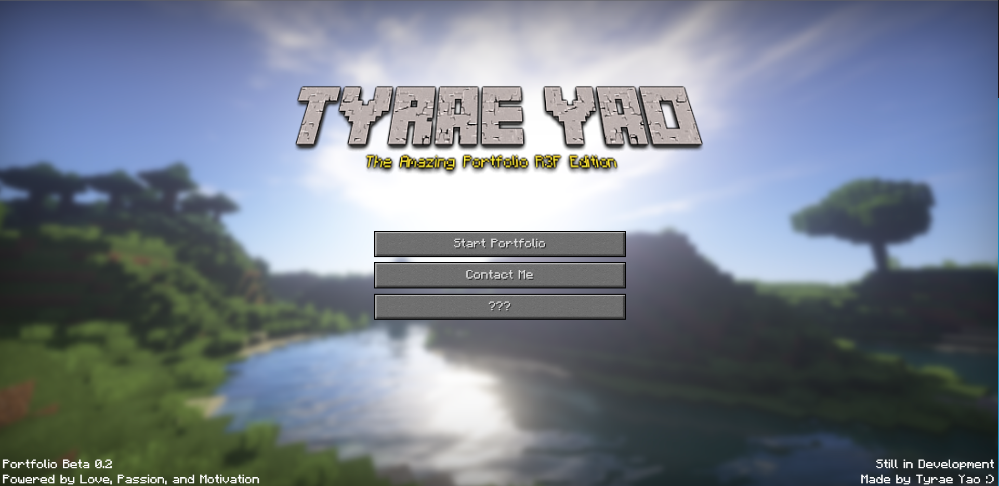
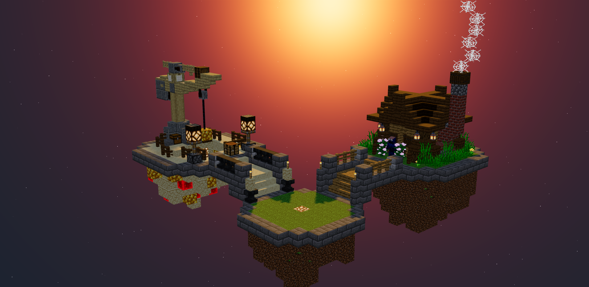
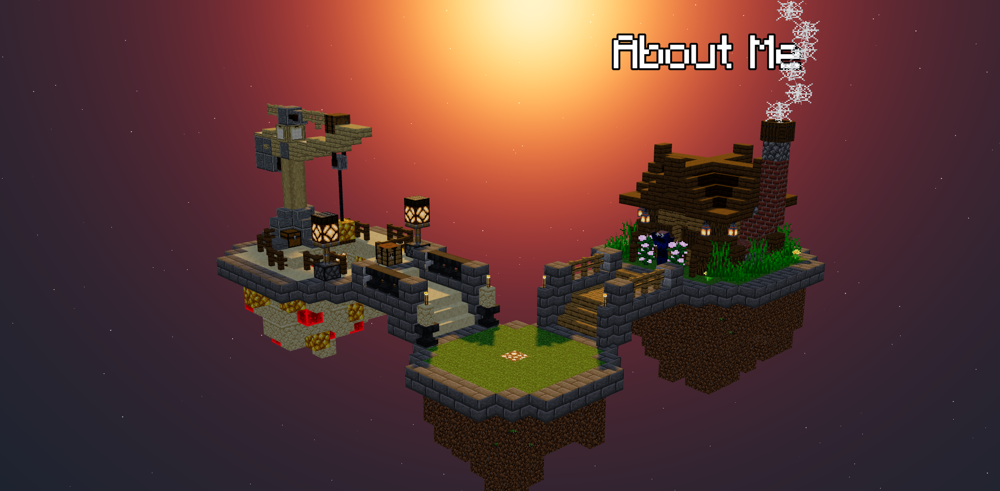

<div id="top"></div>
<!--
*** Thanks for checking out the Best-README-Template. If you have a suggestion
*** that would make this better, please fork the repo and create a pull request
*** or simply open an issue with the tag "enhancement".
*** Don't forget to give the project a star!
*** Thanks again! Now go create something AMAZING! :D
-->

<!-- PROJECT SHIELDS -->
<!--
*** I'm using markdown "reference style" links for readability.
*** Reference links are enclosed in brackets [ ] instead of parentheses ( ).
*** See the bottom of this document for the declaration of the reference variables
*** for contributors-url, forks-url, etc. This is an optional, concise syntax you may use.
*** https://www.markdownguide.org/basic-syntax/#reference-style-links
-->

[![Contributors][contributors-shield]][contributors-url]
[![Forks][forks-shield]][forks-url]
[![Stargazers][stars-shield]][stars-url]
[![Issues][issues-shield]][issues-url]
[![MIT License][license-shield]][license-url]
[![LinkedIn][linkedin-shield]][linkedin-url]

<!-- PROJECT LOGO -->
<br />
<div align="center">
  <a href="https://github.com/Midcrash/r3f-minecraft-portfolio">
    <!--  -->
  </a>

<h3 align="center">Portfolio by Tyrae Yao</h3>

  <p align="center">
    My portfolio made with React Three Fiber.
  </p>
</div>

<!-- TABLE OF CONTENTS -->
<details>
  <summary>Table of Contents</summary>
  <ol>
    <li>
      <a href="#about-the-project">About The Project</a>
      <ul>
        <li><a href="#built-with">Built With</a></li>
      </ul>
    </li>
    <li>
      <a href="#getting-started">Getting Started</a>
      <ul>
        <li><a href="#prerequisites">Prerequisites</a></li>
        <li><a href="#installation">Installation</a></li>
      </ul>
    </li>
    <li><a href="#usage">Usage</a></li>
    <li><a href="#roadmap">Roadmap</a></li>
    <li><a href="#contact">Contact</a></li>
  </ol>
</details>

<!-- ABOUT THE PROJECT -->

## About The Project



I was inspired to make this portfolio website after taking the THREE.JS course from Bruno Simon. I wanted to create something meaningful to me whilst testing my limits on what I learned throughout that course. I also wanted to implemenet the usage of React because I have been using that framework for a while now. Hopefully this showcases some of my skills and to land a job or apprenticeship!

This portfolio project is still underdevelopment and I hope to gain some inspiration to finish it soon!

<p align="right">(<a href="#top">back to top</a>)</p>

### Built With

- [React.js](https://reactjs.org/)
- [React Three Fiber](https://github.com/pmndrs/react-three-fiber)
- [React Drei](https://github.com/pmndrs/drei)
- [React Router](https://reactrouter.com/docs/en/v6/getting-started/overview)
- [Blender](https://www.blender.org/)

<p align="right">(<a href="#top">back to top</a>)</p>

<!-- GETTING STARTED -->

## Getting Started

To get a local copy up and running follow these simple example steps.

### Prerequisites

This is an example of how to list things you need to use the software and how to install them.

- npm
  ```sh
  npm install npm@latest -g
  ```

### Installation

1. Clone the repo
   ```sh
   git clone https://github.com/Midcrash/r3f-minecraft-portfolio
   ```
2. Install NPM packages
   ```sh
   npm install
   ```
3. Start your environment
   ```sh
   npm start
   ```

From here, you should be able to go to `localhost:3000` and see the forked repo.

<p align="right">(<a href="#top">back to top</a>)</p>

<!-- USAGE EXAMPLES -->

## Usage

After clicking the, "Start Portfolio" button. You will see this page.



Hover over an island to open the modal windows!



<p align="right">(<a href="#top">back to top</a>)</p>

<!-- ROADMAP -->

## Roadmap

- [ ] Landing Page
  - [x] Create buttons w/ routes
  - [x] Play sounds when button clicked
  - [x] Design the page like MC home page
  - [ ] Add routes to all buttons
- [ ] Portfolio Page
  - [x] Create minecraft world in Blender
  - [x] Import .glb file to React Three
  - [x] Create the canvas for Three.JS
    - [x] Rotate camera on pivot point
    - [x] Display text on Island hover
      - [x] Text follow camera
    - [x] Display modal window on Island click
    - [ ] Finish up designing modal windows and information
      - [ ] Add projects to projects modal
- [ ] Contact Me

See the [open issues](https://github.com/Midcrash/Midcrash/r3f-minecraft-portfolio/issues) for a full list of proposed features (and known issues).

<p align="right">(<a href="#top">back to top</a>)</p>

<!-- CONTACT -->

## Contact

Tyrae Yao - [@Tyao25567946](https://twitter.com/Tyao25567946) - yaotyrae@gmail.com

Project Link: [https://github.com/Midcrash/r3f-minecraft-portfolio](https://github.com/Midcrash/r3f-minecraft-portfolio)

<p align="right">(<a href="#top">back to top</a>)</p>

<!-- MARKDOWN LINKS & IMAGES -->
<!-- https://www.markdownguide.org/basic-syntax/#reference-style-links -->

[contributors-shield]: https://img.shields.io/github/contributors/Midcrash/r3f-minecraft-portfolio.svg?style=for-the-badge
[contributors-url]: https://github.com/Midcrash/r3f-minecraft-portfolio/graphs/contributors
[forks-shield]: https://img.shields.io/github/forks/Midcrash/r3f-minecraft-portfolio.svg?style=for-the-badge
[forks-url]: https://github.com/Midcrash/r3f-minecraft-portfolio/network/members
[stars-shield]: https://img.shields.io/github/stars/Midcrash/r3f-minecraft-portfolio.svg?style=for-the-badge
[stars-url]: https://github.com/Midcrash/r3f-minecraft-portfolio/stargazers
[issues-shield]: https://img.shields.io/github/issues/Midcrash/r3f-minecraft-portfolio.svg?style=for-the-badge
[issues-url]: https://github.com/Midcrash/r3f-minecraft-portfolio/issues
[license-shield]: https://img.shields.io/github/license/Midcrash/r3f-minecraft-portfolio.svg?style=for-the-badge
[license-url]: https://github.com/Midcrash/r3f-minecraft-portfolio/blob/master/LICENSE.txt
[linkedin-shield]: https://img.shields.io/badge/-LinkedIn-black.svg?style=for-the-badge&logo=linkedin&colorB=555
[linkedin-url]: https://linkedin.com/in/tyrae-yao-08b684154

<!-- [product-screenshot]: images\Capture.PNG
[usage-screenshot]: images\Capture2.PNG
[usage-screenshot2]: images\Capture3.PNG -->
